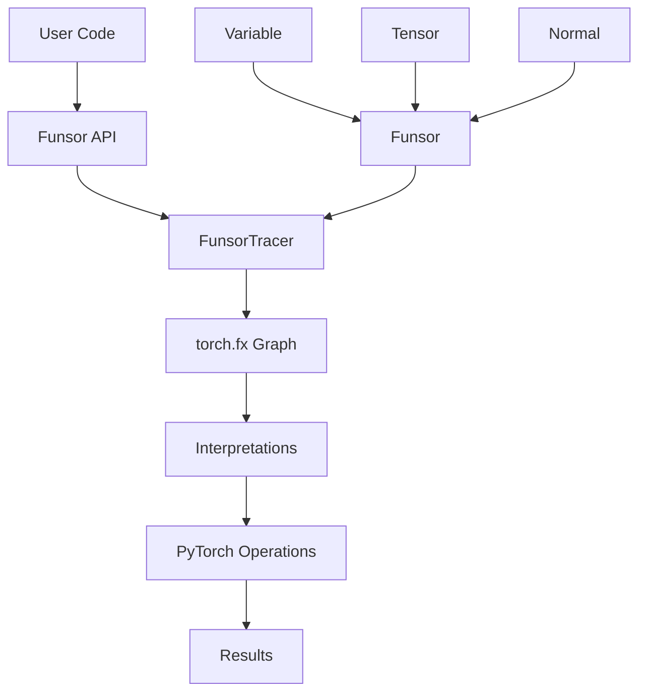
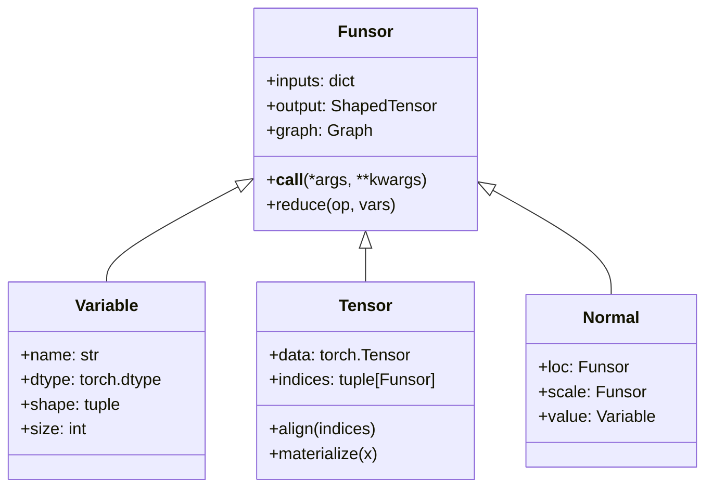

# torch-funsor Design Document

## Table of Contents
- [Project Overview](#project-overview)
- [Architecture Overview](#architecture-overview)
- [Core Components](#core-components)
- [Key Classes and Relationships](#key-classes-and-relationships)
- [Design Patterns](#design-patterns)
- [Operation Support](#operation-support)
- [PyTorch Integration](#pytorch-integration)
- [Key Features](#key-features)
- [Implementation Details](#implementation-details)
- [Testing Framework](#testing-framework)
- [Dependencies and Requirements](#dependencies-and-requirements)

## Project Overview

**torch-funsor** is a PyTorch-native reimplementation of the [Funsor library](https://arxiv.org/abs/1910.10775) that provides tensor-like operations on functions and distributions. It enables sophisticated probabilistic programming and symbolic computation while maintaining seamless interoperability with PyTorch tensors.

### Purpose
- Provide functional tensor operations that support both concrete values and symbolic computation
- Enable natural mixing of PyTorch tensors and Funsor objects
- Leverage PyTorch's `torch.fx` framework for efficient computation graphs
- Support advanced indexing patterns with named dimensions

### Key Benefits
- **Native PyTorch Integration**: Direct interoperability between PyTorch tensors and Funsor objects
- **Efficient Computation**: Uses `torch.fx` backend for optimized execution
- **Symbolic Programming**: Enables deferred computation with named variables
- **Advanced Indexing**: Supports complex indexing patterns with variable dimensions

## Architecture Overview

The torch-funsor architecture is built around several key principles:

1. **Functional Programming**: Immutable objects with pure functional operations
2. **Symbolic Computation**: Variables represent symbolic placeholders that can be substituted later
3. **Graph-based Computation**: Uses PyTorch's `torch.fx` to build and optimize computation graphs
4. **Type Safety**: Strong typing with metadata preservation through computation chains



## Core Components

### 1. **Funsor Base Class** (`funsor/terms.py`)
The abstract base class for all functional tensors. Provides:
- Immutable functional tensor interface
- Symbolic variable management
- Graph construction via `torch.fx`
- Input/output domain tracking

### 2. **FunsorTracer** (`funsor/terms.py`)
Custom tracer extending PyTorch's `MetaTracer` that:
- Builds computation graphs using `torch.fx`
- Handles shape and dtype inference
- Manages variable caching and reuse
- Supports custom operations like `align()`

### 3. **Variable Class** (`funsor/terms.py`)
Represents symbolic variables with:
- Named dimensions
- Type information (dtype, shape)
- Size constraints for discrete variables
- Placeholder nodes in computation graphs

### 4. **Tensor Class** (`funsor/tensor.py`)
Concrete tensor implementation that:
- Wraps PyTorch tensors with named indices
- Supports advanced indexing with Variables
- Handles dimension alignment and broadcasting
- Provides vectorized operations via `torch.vmap`

### 5. **Interpretation System** (`funsor/interpretations.py`)
Pluggable interpretation framework with:
- Pattern matching for operation dispatch
- Multiple interpretation strategies (eager, lazy)
- Extensible design for custom interpretations

## Key Classes and Relationships

### Class Hierarchy


### Key Relationships

1. **Funsor → Variable**: Variables are the basic building blocks representing symbolic placeholders
2. **Funsor → Tensor**: Tensors wrap PyTorch tensors with named dimensions
3. **Tensor → Variable**: Tensors use Variables as dimension indices
4. **FunsorTracer → Funsor**: All Funsors are created through the tracer for graph construction

### ShapedTensor Type System
```python
ShapedTensor[torch.float32, (3, 4)]  # Type with shape information
ShapedTensor[int, ()]                # Scalar integer type
```

## Design Patterns

### 1. **Metaclass Pattern**
- `FunsorMeta` intercepts construction calls
- Routes through interpretation system
- Enables caching and optimization

### 2. **Interpretation Pattern**
- Pluggable interpretation strategies
- Pattern matching for operation dispatch
- Separation of concerns between syntax and semantics

### 3. **Proxy Pattern**
- `Funsor` acts as proxy for computation graphs
- Deferred execution until materialization
- Transparent operation forwarding

### 4. **Factory Pattern**
- Different construction strategies based on context
- Automatic type inference and validation
- Caching for identical constructions

### 5. **Visitor Pattern**
- Operations traverse and transform computation graphs
- Supports reduction operations
- Enables optimization passes

## Operation Support

### Arithmetic Operations
- **Binary Operations**: `+`, `-`, `*`, `/`, `//`, `**`
- **Unary Operations**: `-`, `abs()`
- **Comparison Operations**: `==`, `!=`, `<`, `<=`, `>`, `>=`

### Mathematical Functions
```python
# Math module functions
math.fabs, math.ceil, math.floor, math.exp, math.expm1, 
math.log, math.log1p, math.sqrt

# PyTorch functions  
torch.abs, torch.ceil, torch.floor, torch.exp, torch.expm1,
torch.log, torch.log1p, torch.sqrt, torch.acos, torch.cos,
torch.sigmoid, torch.tanh, torch.sin, torch.atanh, torch.asin

# PyTorch binary operations
torch.maximum, torch.minimum, torch.add, torch.sub, torch.mul,
torch.div, torch.floor_divide, torch.pow, torch.logaddexp
```

### Logical Operations
- **Boolean Operations**: `&`, `|`, `^` (and, or, xor)
- **PyTorch Logical**: `torch.logical_and`, `torch.logical_or`, `torch.logical_xor`

### Advanced Operations
- **Indexing**: Advanced tensor indexing with Variables
- **Reduction**: Sum, product, etc. over named dimensions
- **Alignment**: Automatic dimension alignment for broadcasting
- **Integration**: Probabilistic integration operations

## PyTorch Integration

### torch.fx Backend
- **Graph Construction**: Uses `torch.fx` for building computation graphs
- **Optimization**: Leverages PyTorch's optimization passes
- **Meta Tensors**: Shape inference using meta device
- **Vectorization**: Automatic vectorization via `torch.vmap`

### Tensor Interoperability
```python
# PyTorch tensors can be used directly
x = torch.randn(3, 4)
i = Variable("i", int)
j = Variable("j", int)
tensor = Tensor(x, (i, j))

# Operations work seamlessly
result = tensor + torch.ones(3, 4)
```

### Magic Method Integration
- **Operator Overloading**: All Python operators work naturally
- **Reflection**: Right-hand operations supported
- **Torch Functions**: `__torch_function__` protocol integration

## Key Features

### Named Dimensions
```python
i = Variable("i", int)
j = Variable("j", int) 
x = Tensor(torch.randn(3, 4), (i, j))
y = x(i=1)  # Select along dimension i
```

### Advanced Indexing
```python
# Multi-dimensional advanced indexing
x = Tensor(torch.randn(2, 3, 4), (Variable("i", int), Variable("j", int), Variable("k", int)))
i_idx = Tensor(torch.tensor([0, 1]), (Variable("u", int),))
j_idx = Tensor(torch.tensor([1, 2]), (Variable("v", int),))
result = x(i_idx, j_idx)  # Advanced indexing
```

### Dimension Alignment
```python
# Automatic alignment for broadcasting
x = Tensor(data1, (i, j))
y = Tensor(data2, (j, k))
z = x + y  # Automatically aligns dimensions
```

### Probabilistic Programming
```python
# Distribution support
loc = Variable("loc", float)
scale = Variable("scale", float) 
normal = Normal(loc, scale)
log_prob = normal(value=1.0)
```

## Implementation Details

### Caching Strategy
- **Construction Caching**: Identical Funsor constructions return same object
- **Graph Sharing**: Common subexpressions share graph nodes
- **Meta Information**: Efficient shape/dtype inference caching

### Memory Management
- **Immutable Objects**: No in-place modifications
- **Shared References**: Multiple Funsors can reference same data
- **Lazy Evaluation**: Computation deferred until materialization

### Error Handling
- **Type Checking**: Strong type validation at construction
- **Shape Inference**: Automatic shape checking and inference  
- **Dimension Validation**: Named dimension consistency checking

### Performance Optimizations
- **Vectorization**: `torch.vmap` for batched operations
- **Graph Optimization**: Dead code elimination
- **Scalar Handling**: Special handling for scalar tensor operations

## Testing Framework

### Test Organization
- **`test_terms.py`**: Variable and base Funsor functionality
- **`test_tensor.py`**: Tensor operations and indexing
- **Unit Tests**: Comprehensive operation coverage
- **Property Tests**: Type safety and invariant checking

### Test Utilities (`funsor/utilities/testing.py`)
```python
# Operation test coverage
OPERATOR_BINARY_OPS    # Standard Python operators
TORCH_BINARY_OPS      # PyTorch binary functions  
TORCH_BOOLEAN_OPS     # PyTorch logical operations

# Helper functions
check_funsor()        # Validate Funsor properties
assert_equiv()        # Compare Funsor equivalence
eval_shape()          # Shape inference testing
```

### Validation Strategy
- **Round-trip Testing**: Construction → operation → evaluation
- **Equivalence Testing**: Compare with direct PyTorch operations
- **Property Testing**: Algebraic properties and invariants
- **Integration Testing**: End-to-end scenarios

## Dependencies and Requirements

### Core Dependencies
```toml
dependencies = [
  "numpy>=2.0.0",
  "torch>=2.2.0", 
]
```

### Development Dependencies
- **Linting**: `ruff` for code quality
- **Type Checking**: `mypy` for static analysis
- **Testing**: `pytest-xdist` for parallel testing
- **Documentation**: Sphinx ecosystem for docs

### Python Requirements
- **Python Version**: `>=3.10`
- **PyTorch Features**: Requires modern PyTorch with `torch.fx` support
- **Type Hints**: Extensive use of modern Python typing features

### System Requirements
- **Memory**: Efficient memory usage through immutable design
- **Compute**: Leverages PyTorch's optimized operations
- **GPU Support**: Inherits PyTorch's CUDA capabilities

## Future Considerations

### Extensibility Points
1. **Custom Interpretations**: New interpretation strategies
2. **Domain-Specific Operations**: Probabilistic programming extensions  
3. **Optimization Passes**: Custom `torch.fx` transformations
4. **Backend Plugins**: Alternative execution engines

### Performance Optimizations
1. **JIT Compilation**: `torch.jit` integration
2. **Memory Pooling**: Advanced memory management
3. **Parallel Execution**: Multi-GPU and distributed support
4. **Symbolic Compilation**: AOT compilation strategies

This design document provides a comprehensive overview of the torch-funsor architecture, implementation, and design principles. The library successfully bridges symbolic computation with PyTorch's tensor operations, enabling powerful functional programming patterns while maintaining performance and interoperability.
